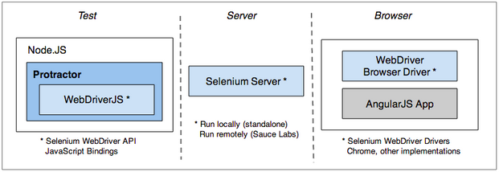

What is Protractor
------------------

1. An AngularJS E2E Testing Framework
2. Introduced during AngularJS 1.2 and Beyond presentation
3. A new replacement of the existing E2E Testing framework


Features
---------

1. Allows running tests targeting remote addresses, No longer need to have test files on the server being tested
2. Built on WebdriverJS and Selenium Server
3. New syntax when writing tests
4. Can use Jasmine or Mocha to write test suites


How it Works
-------------

1. Runs on NodeJS server
2. Protractor uses WebDriver API to send test cases to Web Server
3. Web Server interpretter compiles it down to JSON and passed it to browser



Installation
------------

1. [Install NodeJS server](http://nodejs.org/download/) 
2. 
3. Install Protractor via Node Package Manager (NPM) (This is similar to NUGET)
4. Install Selenium Server
	
	````  npm install protractor --save-dev ````
	```` .bin\webdriver-manager update ````


Running Test Scripts
--------------------

1. 