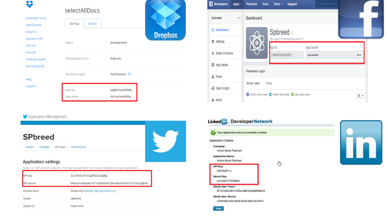

Web Standards
-------------

* Web standards are the formal, non-proprietary standards and other technical specifications that define and describe aspects of the World Wide Web.

* Protocols, best practices, Strategies used with any front end development

* Helps to develop powerful, flexible, modular, expressive enterprise applications using HTML, Javascript and CSS

Web Standards- Adoption 
-----------------------

* AppModel is now a standard in developing and deploying apps

* Adopted by few big names including Microsoft

